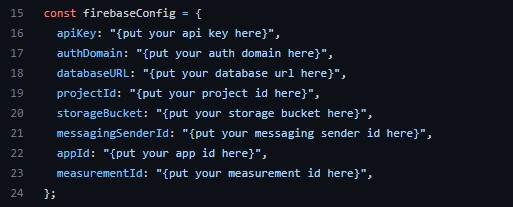

## Proxy : The Face-Recognition Attendence System


Proxy is a attendence marking tool with the help of Face-Recognition. It Detects faces and recognize them and on the basis of given data it marks their attendence. It is easily Integratable with any web-based app.

* Supported by Tensorflow **<a href="https://github.com/justadudewhohacks/face-api.js/">Face-Api</a>**.
* Marks attendence of Students/Employees by recognizing their face.
* Data is stored on Firebase.
* manage Students/Employee
* High Availability

## Installation

* **Method 1** : 
                 git clone Command : ```git clone https://github.com/saurabh100ni/Proxy ```

                 * run command "npm install" (Only for first time)
                 
                 * run command "npm run dev"
                 
                 * now your app is hosted on local server with given port : localhost:<port>
                

* **Method 2** : Download and use [*install.bat*](https://drive.google.com/file/d/1vykZUs2ur2_kcO57H1D5Dk7ZBzcWQbe2/view?usp=sharing) file and execute it.
                 
                 * run *initialize.bat* (Only for first time)
                 
                 * run *run.bat*
                 
                 * now your app is hosted on local server with given port : localhost:<port>

## Used Techonolgies

* HTML
* BootStrap
* vite
* vanilla js
* [Tensorflow Face-Api](https://github.com/vladmandic/face-api)
* Google Firebase 
* Azure Qna Services

## How it Works

1. **FAQ** : there is an FAQ section which is basically an bot based on `Azure Bot services` which retrieves data from `Azure Knowledge base` from `Azure Qna Services`
2. **Login and Signup** : `firebase authentication services` are used to authenticate user for login or sign up.
3. **Registeration of Employees/Students** : for registration and storing the data of user `firestore Database` is used and `firebase Storage` is used
4. **Face-Recognition** : to detect and recognize faces `Tensorflow Face-Api` is used . the data of person is retrieved from the `firestore Database` and the attendence is updated on `firestore Database` for each day.

## Features

* High Availability
* Easy Integration
* Face-Recognition
* Realtime Database
* Easy UI

## Important Configuration

1. update line 16 to 23 with your firebase credentials in [/lib/firebase.js](https://github.com/saurabh100ni/Proxy/blob/main/lib/firebase.js)


    


2. update line 203 to 205 in [index.html](https://github.com/saurabh100ni/Proxy/blob/main/index.html) with youre Azure Qna services chat-bot credentials


    
    
3. update your firestore database rules as given below
  ```
    rules_version = '2';
    service cloud.firestore {
      match /databases/{database}/documents {
        match /{document=**} {
          allow read, write: if true;
        }
      }
    }
  ```

4. update your firebase storage rules as given below
  ```
    rules_version = '2';
      service firebase.storage {
         match /b/{bucket}/o {
          match /{allPaths=**} {
            allow read, write;
      }
     }
    }
  
  ```
  

## Contact

feel free to contact me for anything related to this

* Linkedin : https://www.linkedin.com/in/saurabh100ni/

* Email : saurabhsonig12@gmail.com

